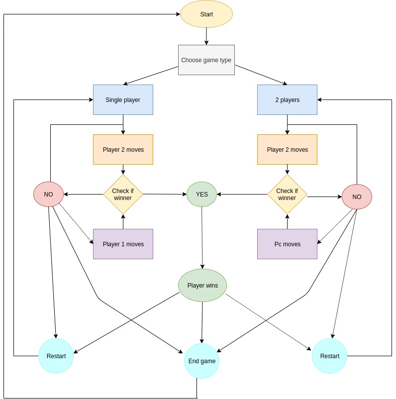
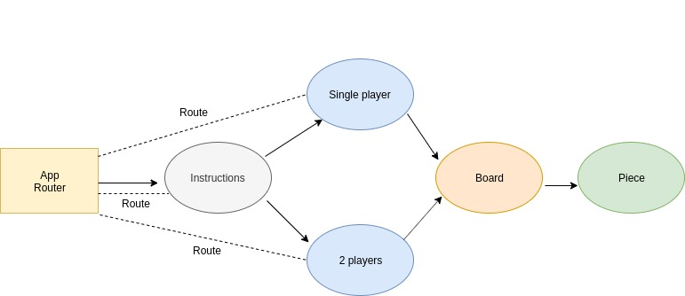

## FOUR IN A ROW

<p align="center">
  
</p>

Four in a Row is an online version of the classic two-player connection game. Every player starts with one color and plays by turns. When select a column, the piece will drop to the available place in bottom. The first who connect four pieces vertically, horizontally or diagonally before the rival, wins.

### **Features**

- The first screen shows the instructions and ask the user to play against the computer or agains another user in the same Pc.
- When a user plays against a friend, the turns will switch in the same computer, so the two players must stay together.
- When the user plays against the computer, the user starts playing and next, the computer will respond placing a piece.
- A message will be shown in case of any player wins or a draw is made, finishing the game this way.
- Anytime is possible to restart the game or exit to change the mode.

### **What I learned**

- Develop logic with multidimensional array.
- Utilize props and state properly in a React project.
- Create Routes with React Router.
- Create HTML elements dynamically linking to a specific classes.
- Solve common React errors like "use unique keys when render an element" or "use ES6 syntax".
- Deploy the project to production in Github pages configuring the routes.
- Add proptypes support to enforce some props.
- Add eslint support to help keeping the code clean.

### **Functional description**

Flow diagram:



### **Technical description**

This project was made with React and React Router.
Components diagram:




### **Resources**

- Icons from [Font Awesome](https://fontawesome.com/icons?d=gallery).
- Background designed by "rawpixel.com" from [Freepik](https://www.freepik.es), free with atribution.
- This project was bootstrapped with [Create React App](https://github.com/facebook/create-react-app), from Facebook.
- Router from an Npm package [Npm React Router](https://www.npmjs.com/package/react-router-dom).
- Prop-types from [Npm Prop-types](https://www.npmjs.com/package/prop-types).
- Eslint from [Npm Eslint](https://www.npmjs.com/package/eslint-plugin-react).

### **Usage**

You can run the final project deployed here: https://diana-moreno.github.io/four-in-a-row/

To run the game in local:

- Install Node.js at the terminal if you haven't yet (https://nodejs.org/es/). Commands for Ubuntu:

```bash
sudo apt-get update
sudo apt-get install nodejs
```
- You will need to install the package manager npm:

```bash
sudo apt-get install npm
```
- Clone or download the repository in your computer.

```bash
git clone https://github.com/diana-moreno/four-in-a-row.git`
```
- Download the npm competitions in your own repository and start it.

```bash
npm install
npm start
```

### Available Scripts

In the project directory, you can run:

#### `npm start`

Runs the app in the development mode.<br>
Open [http://localhost:3000](http://localhost:3000) to view it in the browser.

The page will reload if you make edits.<br>
You will also see any lint errors in the console.

#### `npm test`

Launches the test runner in the interactive watch mode.<br>
See the section about [running tests](https://facebook.github.io/create-react-app/docs/running-tests) for more information.

#### `npm run build`

Builds the app for production to the `build` folder.<br>
It correctly bundles React in production mode and optimizes the build for the best performance.

The build is minified and the filenames include the hashes.<br>
Your app is ready to be deployed!

See the section about [deployment](https://facebook.github.io/create-react-app/docs/deployment) for more information.

#### `npm run eject`

**Note: this is a one-way operation. Once you `eject`, you can’t go back!**

If you aren’t satisfied with the build tool and configuration choices, you can `eject` at any time. This command will remove the single build dependency from your project.

Instead, it will copy all the configuration files and the transitive dependencies (Webpack, Babel, ESLint, etc) right into your project so you have full control over them. All of the commands except `eject` will still work, but they will point to the copied scripts so you can tweak them. At this point you’re on your own.

You don’t have to ever use `eject`. The curated feature set is suitable for small and middle deployments, and you shouldn’t feel obligated to use this feature. However we understand that this tool wouldn’t be useful if you couldn’t customize it when you are ready for it.


### More

#### Learn More

You can learn more in the [Create React App documentation](https://facebook.github.io/create-react-app/docs/getting-started).

To learn React, check out the [React documentation](https://reactjs.org/).

#### Code Splitting

This section has moved here: https://facebook.github.io/create-react-app/docs/code-splitting

#### Analyzing the Bundle Size

This section has moved here: https://facebook.github.io/create-react-app/docs/analyzing-the-bundle-size

#### Making a Progressive Web App

This section has moved here: https://facebook.github.io/create-react-app/docs/making-a-progressive-web-app

#### Advanced Configuration

This section has moved here: https://facebook.github.io/create-react-app/docs/advanced-configuration

#### Deployment

This section has moved here: https://facebook.github.io/create-react-app/docs/deployment

#### `npm run build` fails to minify

This section has moved here: https://facebook.github.io/create-react-app/docs/troubleshooting#npm-run-build-fails-to-minify
