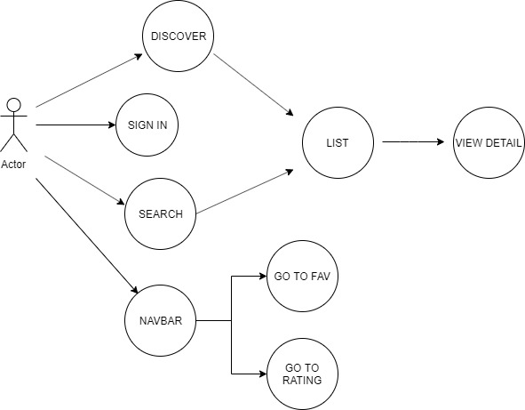
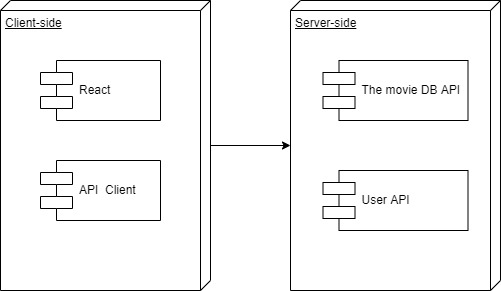
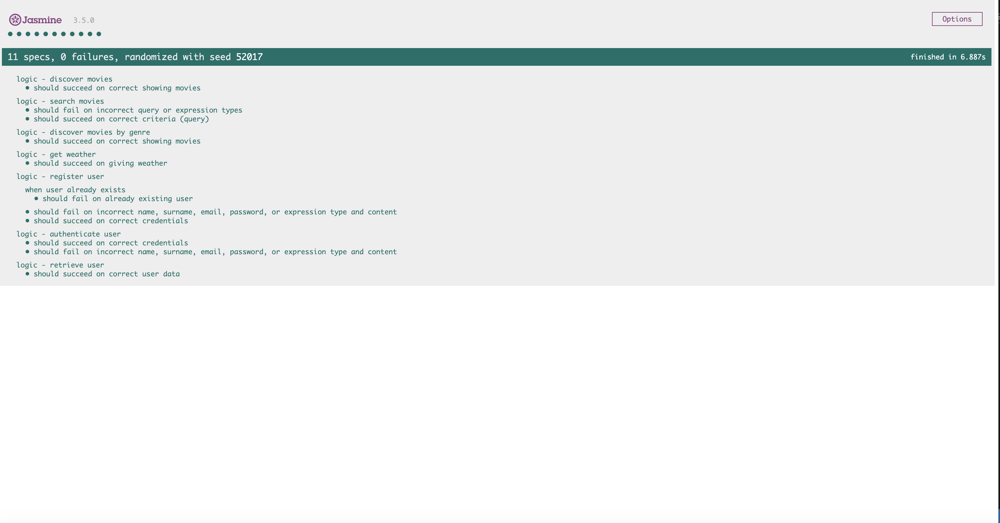
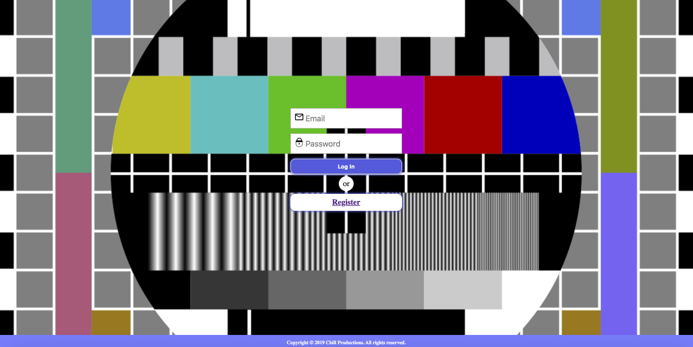
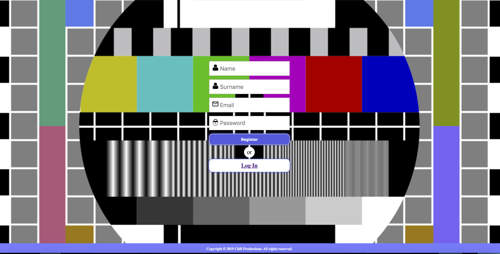
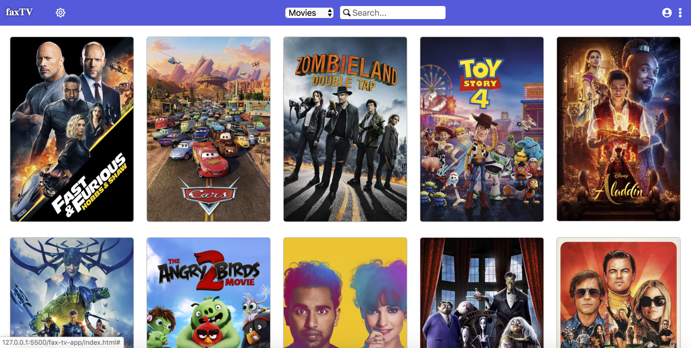

# MOVIE-LAB

## Introduction:

This application allows searches through [The Movie DB] (https://www.themoviedb.org/).
You can search movies and TV shows by keyword and genre, launch different collections.
After the search, you can view the details of all listed movies and add them to favorites and custom lists.
In addition, the application recommends a list of movies based on the time foreseen in Skylab.

The application is developed with [React] (https://reactjs.org). The design has been made with SASS.

## Functional Description

### Use Cases

### Activity Diagram

## Technical Description:

### Blocks

### Components

### Data Model

### Code Coverage

### Screenshots

