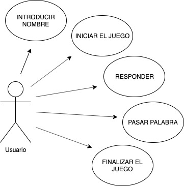
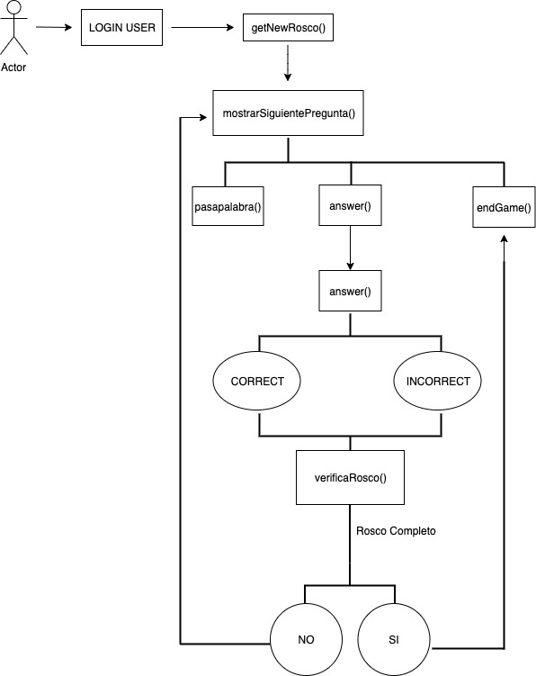

# PASAPALABRA

Documento técnico del proyecto del pre-curso de Slylab "Pasapalabra-HTML".

## Functional Description

Juego popular de TV basado en responder correctamente las definiciones indicadas

## Use Cases

## Activities

## Tecnología utilizada

Para realizar este proyecto se ha utilizado HTML5, CSS y JavaScript.

