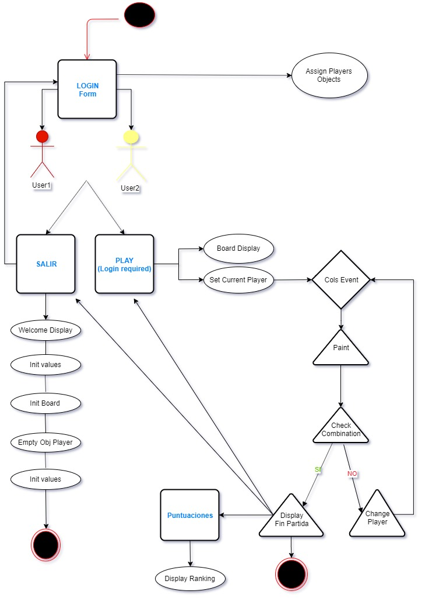

# Connect4

## Description

Connect Four is a tic-tac-toe like game in which two players drop discs into a 7x6 board. The first player to get four in a row (either vertically, horizontally, or diagonally) wins.

## Functional Description

Connect4 runs with functional programming, regarding creation of bidimensional board arrays and OOP with the creation of 2 players objects, through which the current player is set in every turn and all specific data of the player is stored accordingly.

The main features of the programming language included in this project:

1. Creation of bidimensional array through html elements (divs).

2. Menu elements events and modals for the players to interact with.

3. Factory function to create 2 players.

4. Game developing activities according to the following scheme:

## To Do

- Create board without html elements (through new Array() and link through ID's).
- Complete Login Form and connect to server.
- Implement styles
- Diagonal check to be painted.
- Implement with algorithm IA to play agains the machine.

## Installation

To install this project go to [Connect4](https://github.com/manoli2013/Connect4.git) and clone it to your local repository.

## Usage

The next section is usage, in which you instruct other people on how to use your project after they’ve installed it. This would also be a good place to include screenshots of your project in action.

---

## Credits

This project has been developed by [Noli Pascual](https://github.com/manoli2013).

