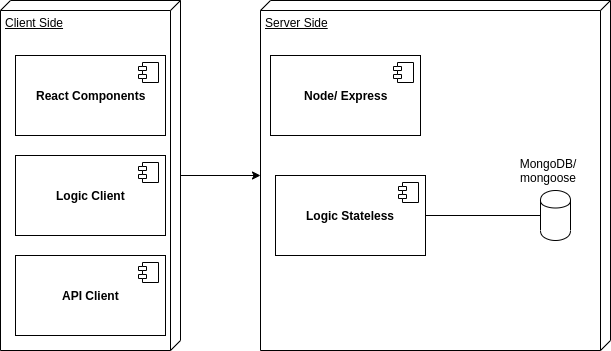
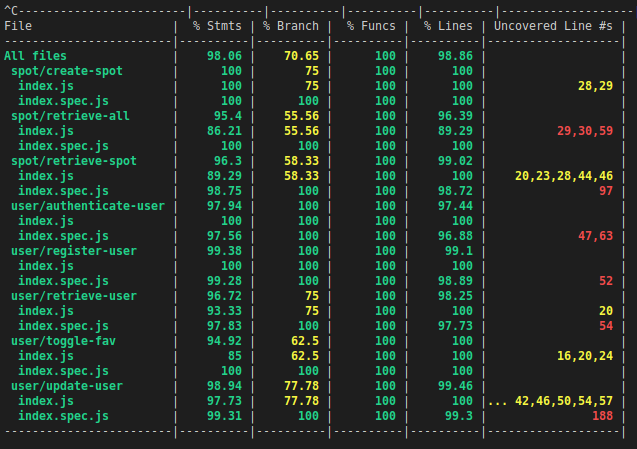

# Flott

## Introduction:

**Flott** is an app designed for people who practice action sports and want to find new places where they can practice it and meet new people.

The application is developed with [React](https://reactjs.org) and [node.js](https://nodejs.org/es/). The design has been made with SASS.

## Functional Description

### Use Cases

## Technical Description:

### Blocks

### Components

### Data Model

## Code Coverage

## Future updates
- Finish test app logic
- Modify User
- Modify Spot
- Implent geolocation
- Maps
- Add posts
- Followers
- Filters in search
