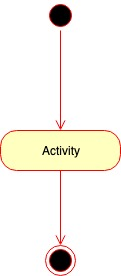

# Hello World

blah blah blah

## Functional Description

blah blah blah

### Use Cases

blah blah blah

### Activities

blah blah blah

## Technical Description

blah blah blah

### Blocks

blah blah blah

### Components

blah blah blah

### Classes

blah blah blah

### Sequences

blah blah blah

### Data Model

blah blah blah

